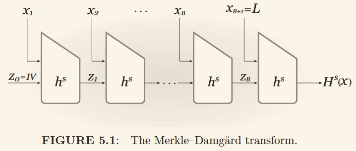

# What did you learn？

## [Number 15: Key generation, encryption and decryption algorithms for RSA-OAEP and ECIES.](https://bristolcrypto.blogspot.com/2015/01/key-generation-encryption-and.html)

### 1. RSA-OAEP

#### 1.1 RSA

略

#### 1.2 OAEP

Optimal Asymmetric Encryption Padding
它是与非对称加密（通常是 RSA）一起使用的填充方案。它可以给确定性加密方案带来一些随机性。当与 RSA 一起使用时，组合方案被证明是 IND-CCA 安全的。

令

- $f$ 是一个 $k$ 比特的陷门单向置换（trapdoor one-way permutation）：$f:\{0,1\}^k \rightarrow \{0,1\}^k$
- $m$ 是一个 $n$ 比特的消息
- $G,H$ 是两个伪随机函数，其中 $G:\{0,1\}^s \rightarrow \{0,1\}^{n+t},H:\{0,1\}^{n+t} \rightarrow \{0,1\}^s,\ where\ k=n+t+s$
- $R$ 是一个 $s$ 比特的随机数: $R \overset{\$}{\leftarrow} \{0,1\}^s$

**Encryption:**
计算 $k$ 比特密文的过程如下：
$$
E(m) = f_{pk}(\{(m||0^t) \oplus G(R)\} || \{R \oplus H((m||0^t)\oplus G(R)) \})
$$

**Decryption:**
通过陷门解密：
$$
D(c) = f_{sk}(c) = \{(m||0^t) \oplus G(R)\} || \{R \oplus H((m||0^t)\oplus G(R)) \}
$$

然后

1. 令前 $n+t$个比特为 $T:T=(m||0^t) \oplus G(R)$，剩下的 $s$ 比特为 $S:S=R \oplus H((m||0^t)\oplus G(R))$
2. $R$ 可以根据 $R=S\oplus H(T)$ 计算出来
3. 接着计算 $m||0^t=T\oplus G(R)$
4. 可以通过 $n$ 位消息 $m$ 后面是否正好有 $t$ 个 0 来验证有效性。如果有效，则删除前 $t$ 位并输出 $m$。

在实际应用中，我们分别用 RSA 加密和解密函数来代替 $f_{pk}$ 和 $f_{sk}$。

### 2. ECIES

Elliptic Curve Integrated Encryption Scheme
> 是 ElGamal 加密方案在椭圆曲线上的一种变体

#### 2.1 Elliptic Curve

定义在素数域 $F_q$，选择一个点 $P$ 并拥有素数阶 $n$
略（看NO.12）

#### 2.2 ECIES

ECIES 经常与一个对称加密方案和一个 MAC 方案一起使用。

- symmetric encryption scheme : $Enc_k(m)=c,Dec(c)=m$
- MAC scheme : $MAC_k(m)=t,Ver(t,m)=T/F$
- Key Derivation Function : $KDF(s_1,s_2)=(k_{enc},k_{MAC})$，其中 $s_1,s_2$ 是俩种子

**Key Generation：**

1. 选择一个随机整数 $d \in [1,n-1]$
2. 计算一个新的点 $Q=dP$
3. 公钥是 $Q$，私钥是 $d$

**Encryption:**

1. 选择一个随机整数 $k \in [1,n-1]$
2. 计算 $R=kP,z=kQ$，$Z$ 不能是 $\infty$
3. 计算 $(k_1,k_2)=KDF(x_Z,R)$，其中 $x_Z$ 是 $Z$ 的 $x$ 坐标
4. 计算 $c=Enc_{k_1}(m)$，$t=MAC_{k_2}(c)$
5. 输出密文 $(R,c,t)$

**Decryption:**

1. 验证 $R$ 是否有效。通过将 $R$ 代入曲线中可以轻松完成此操作。
2. 计算 $Z'=dR$
3. 计算 $(k'_1,k'_2)=KDF(x_{Z'},R)$，其中 $x_{Z'}$ 是 $Z'$ 的 $x$ 坐标
4. 验证 $Very(t,c)$
5. 解密 $m'=Dec_{k'_1}(c)$
6. 输出明文 $m'$

正确性：$Z'=dR=d(kP)=k(dP)=kQ=Z$

## [Number 16: Describe the key generation, signature and verification algorithms for DSA, Schnorr and RSA-FDH.](https://bristolcrypto.blogspot.com/2015/01/52-things-number-15-describe-key.html)

### 1. Digital Signature Scheme (DSA)

> 也叫 Digital Signature Standard (DSS)

安全性基于计算离散对数的困难性。此外，没有在标准模型下的已知证明。

#### 1.1 Domain Parameter Generation

1. 选择一个素数 $p$，其中 $2^{L−1}<p<2^L$，$L$ 是 64 的倍数，且 $512≤L≤1024$。
2. 选择 $p−1$ 的素因数 $q$，其中 $2^{159}<q<2^{160}$。
3. 计算 $q$ 阶子群的生成元 $g$：选择一个随机整数 $r$，其中 $1<r<p−1$，令 $g=r^{(p−1)/q}\ mod\ p$ 且 $g\neq1$。

> 了解即可

#### 1.2 Key Generation

1. 选择一个随机整数 $x$，其中 $0<x<q$。
2. 计算 $y=g^x\ mod\ p$。

公钥是 $y$，私钥是 $x$。

#### 1.3 Signing

1. 选择一个随机整数 $k$，其中 $0<k<q$。
2. 计算 $r=(g^k\ mod\ p)\ mod\ q$。
3. 计算 $s=k^{-1}\cdot(H(m)+x\cdot r)\ mod\ q$，其中 $H(m)$ 是消息 $m$ 的哈希值（SHA-1）。

对消息 $m$ 的签名是 $(r,s)$。

#### 1.4 Verification

1. 计算 $u_1=H(m)\cdot s^{-1}\ mod\ q$。
2. 计算 $u_2=r\cdot s^{-1}\ mod\ q$。
3. 计算 $v=(g^{u_1}\cdot y^{u_2}\ mod\ p)\ mod\ q$。
4. 如果 $v=r$，则签名有效。

#### 1.5 Correctness

$$
v=g^{u_1}\cdot y^{u_2}=g^{H(m)\cdot s^{-1}}\cdot g^{x\cdot r\cdot s^{-1}}=g^{H(m)\cdot s^{-1}+x\cdot r\cdot s^{-1}}=g^{(H(m)+x\cdot r)\cdot s^{-1}}=g^k=r
$$

### 2. Schnorr Signature Scheme

Schnorr 签名是一种重要的基于 DLP 的签名方案。它适用于任何素数阶群，并且其安全性在 DL 假设下的随机预言模型中得到了证明。

#### 2.1 Domain Parameter Generation

1. 选择一个素数 $p$
2. 选择一个 $p-1$ 的素因数 $q$
3. 选择 $q$ 阶子群的生成元

#### 2.2 Key Generation

1. 选择一个随机整数 $x$，其中 $0<x<q$
2. 计算 $y=g^x\ mod\ p$

公钥是 $y$，私钥是 $x$

#### 2.3 Signing

1. 选择一个随机整数 $k$，其中 $0<k<q$
2. 计算 $a=g^k\ mod\ p$
3. 计算 $r=H(m||a)$
4. 计算 $s=(k+x\cdot r)\ mod\ q$

对消息 $m$ 的签名是 $(r,s)$

#### 2.4 Verification

1. 计算 $v=g^s\cdot y^{-r}\ mod\ p$
2. 如果 $v=a$，则签名有效

#### 2.5 Correctness

$$
v=g^s\cdot y^{-r}=g^{k+x\cdot r}\cdot g^{-r\cdot x}=g^k\cdot g^{x\cdot r}\cdot g^{-r\cdot x}=a
$$

### 3. RSA-FDH

RSA-FDH (full domain hash)是一种基于 RSA 的签名方案，遵循 **hash-then-sign** paradigm。它利用哈希函数（哈希函数的输出范围等于 RSA 模数）为普通 RSA 签名方案生成看起来随机的输出。因此，它可以防止对普通 RSA 签名方案的代数攻击，并且能够对任意长度的消息进行签名。但在实践中很难创建这样的哈希函数。 RSA-FDH 可以在随机预言模型中证明是 EU-CMA 安全的。

#### 3.1 Key Generation

1. 选择两个大素数 $p,q$，计算 $N=p\cdot q$
2. 选择一个整数 $e$，其中 $1<e<\phi(N)$ 且 $gcd(e,\phi(N))=1$
3. 计算 $d=e^{-1}\ mod\ \phi(N)$

公钥是 $(N,e)$，私钥是 $(d,p,q)$

#### 3.2 Signing

1. 计算 $s=H(m)^d\ mod\ N$

对消息 $m$ 的签名是 $s$

#### 3.3 Verification

1. 计算 $s^e\overset{?}{=}H(m)\ mod\ N$

### 4. Correctness

$$
s^e\ mod\ N=H(m)^{d\cdot e}\ mod\ N=H(m)^1\ mod\ N=H(m)
$$

## [Number 17: Describe and compare the round structure of DES and AES.](https://bristolcrypto.blogspot.com/2015/01/52-things-number-17-describe-and.html)

DES 与 AES 都属于迭代分组密码（iterated block ciphers），特点：

- 通过重复使用简单的轮函数获得安全性
- 轮数 $r$ 可变，一般 $r$ 越大，安全性越高
- 每轮的轮密钥都是主密钥通过 key schedule 生成的
- 轮加密是一个可逆的过程，注意轮函数本身n不一定是可逆的

### 1. **DES**

1. 本质属于 Feistel 网络

$$
L_{i+1}=R_i\\
R_{i+1}=L_i\oplus F(R_i,K_i)
$$

2. 轮函数 $F$ 本身不需要可逆，我们只需要使用相反顺序的轮密钥来解密即可；加解密使用相同的操作
3. 参数：
   - 轮数：16
   - 分组长度：64 bits
   - 密钥长度：56 bits
   - Feistel 迭代之前和之后执行一次permutation
4. 轮函数操作（具体不写，没意思）：
   - Expansion Permutation
   - Round Key Addition
   - Splitting
   - S-Box
   - P-Box

### 2. **AES**

1. 不依赖于 Feistel 网络，而是使用了 SPN（Substitution-Permutation Network）
2. 加密和解密操作不同，基于 $F_2^8$ 上的有限域运算
3. 参数：
   - 轮数：10/12/14
   - 分组长度：128 bits
   - 密钥长度：128/192/256 bits
4. 轮函数操作（具体不写，没意思）：
   - SubBytes
   - ShiftRows
   - MixColumns
   - AddRoundKey

## [Number 18: Draw a diagram (or describe) the ECB, CBC and CTR modes of operation](https://bristolcrypto.blogspot.com/2015/02/52-things-number-18-draw-diagram-or.html)

密码学必学内容，具体自己看对应链接，这里只简单过一下

分组密码可以解决一个块的加密问题，而**操作模式**（Modes of operation）可以解决多个块的加密问题。

**[ECB](https://en.wikipedia.org/wiki/File:ECB_encryption.svg)**
明文被分为 $m$ 个块，每个块使用相同的密钥单独加密，但重复的明文块会产生相同的密文块.

**[CBC](https://en.wikipedia.org/wiki/File:CBC_encryption.svg)**
CBC 模式消除了 ECB 模式的局限性。每个明文在加密之前都与先前的密文进行异或，其中第一个明文块与随机初始化向量 (IV) 进行异或。CBC是实践中最常用的模式。

**[CTR](https://en.wikipedia.org/wiki/File:CTR_encryption_2.svg)**
它在某种意义上就像流密码。 CTR 模式通过重复加密“计数器”的连续值来生成密钥流。

p.s.：一些操作模式除了保证明文的机密性之外，还保证其真实性。有关更多信息，请参阅 [AEAD](https://en.wikipedia.org/wiki/Authenticated_encryption) 模式。

## [Number 19: The Shamir secret sharing scheme.](https://bristolcrypto.blogspot.com/2015/02/52-things-number-19-shamir-secret.html)

如果我们有一个秘密 $S$ 和 $n$ 个参与方，我们可以将 $S$ 分成 $n$ 个部分并将其分发给各个参与方。秘密可以以这样的方式划分：可以设置阈值 $k$，使得当秘密 $S$ 的 $k$ 部分已知时，可以计算整个秘密。如果 $S$ 的 $k−1$ 或更少部分已知，则无法计算 $S$。该方案称为 $(k,n)$ threshold scheme。

以一个例子说明：
$S=1425,\ n=5,\ k=3$

首先确定多项式的阶数（order），即 $k−1$，然后随机选取系数，即随机选取$a_1,a_2$，例如：
$$
f(x)=S+a_1x+a_2x^2=1425+64x+112x^2
$$

然后可以计算 $n$ 个点：
$$
f(1)=1425+64+112=1601\\
f(2)=1425+128+448=2001\\
f(3)=1425+192+1008=2625\\
f(4)=1425+256+1792=3473\\
f(5)=1425+320+2816=4545
$$
然后将这些点分发给 $n$ 个参与方。

解密的话，只需要 $k$ 个点即可，然后使用拉格朗日插值法或者列线性方程组即可得到多项式，最后得到 $S$。

> 听不懂这儿的基本可以告别密码学了

## [Number 20: How are Merkle-Damgaard style hash functions constructed?](https://bristolcrypto.blogspot.com/2015/02/52-things-number-20-how-are-merkle.html)

英文教材里基本有，这里简单说一下。

Merkle-Damgaard (MD) 哈希函数是通过扩展抗碰撞压缩函数的域而构建的哈希函数。即，将一个小的压缩函数扩展成一个安全变长的哈希函数

### 1. Secure Hash Function

安全哈希函数 $h$ 的特点：

- Pre-image resistant : 给定 $h(x)$，计算 $x$ 是困难的
- Second pre-image resistance : 给定 $x$，计算 $y$, 使得 $h(x)=h(y)$ 是困难的
- Collision Resistance: 找到 $x,y$，使得 $h(x)=h(y)$ 是困难的

### 2. Compression Function

$$
h:\{0,1\}^n\times \{0,1\}^r \rightarrow\{0,1\}^n
$$
顾名思义就是把 $n+r$ 位的输入压缩成 $n$ 位的输出，当然也是 Collision Resistance 的。可以理解为固定输入长度的哈希函数。

### 3. Merkle-Damgaard hash function Construction

将 “固定输入长度” 变为 “变长输入长度”，维基百科截下来的图：

教材上截下来的图：

输入 $M$ 被分成 $n$ 个块 $M_1,M_2,...,M_m$，然后通过迭代的方式计算哈希值：
$$
S_0=IV\qquad i=0,\cdots m-1\\
S_{i+1}=f(S_{i},M_i)\\
h(M)=S_m
$$

MD 结构最重要的是，如果压缩函数是抗碰撞的，那么整体结构也是抗碰撞的

P.S. : 注意到上图有个 “finalisation” 阶段，这个阶段是为了防止长度扩展攻击（length extension attack）
> 如果 $N$ 是一个块，且已知 $h(M)=x$ ，那么可以通过 $h(M||N)=f(x,N)$ 轻易计算 $M||N$ 的哈希值
